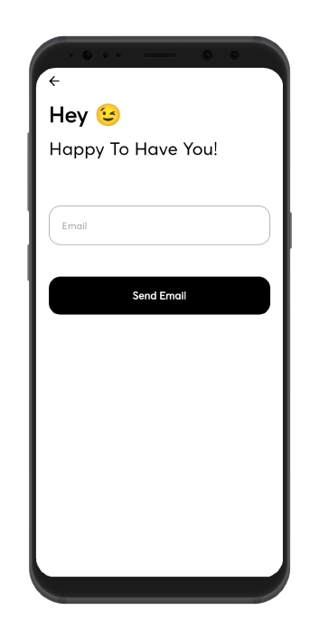
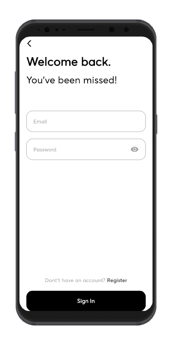
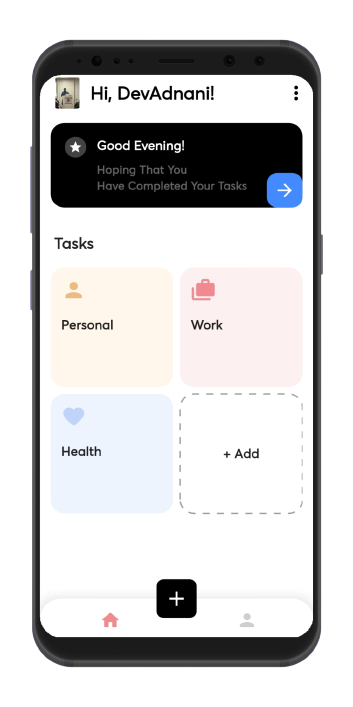
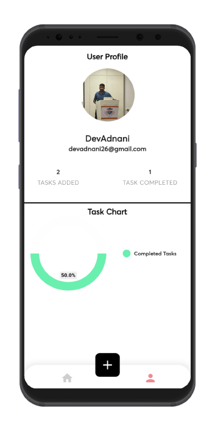
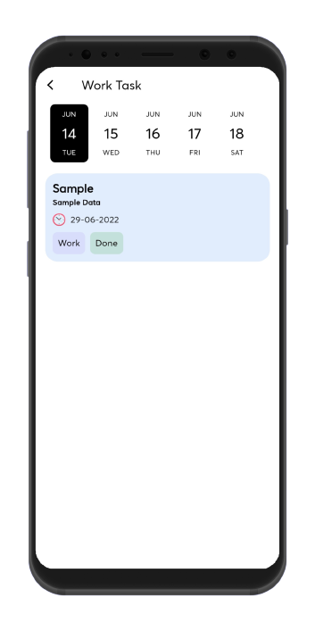
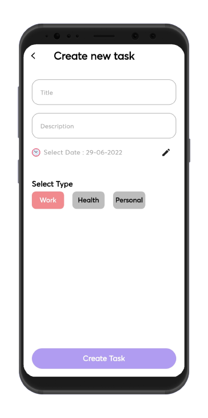
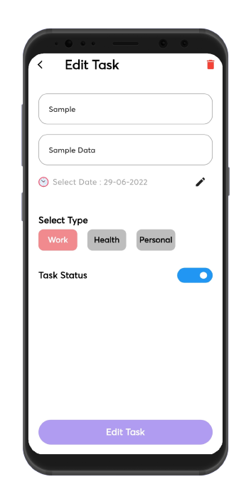

  

# ScreTask App

A Advance Task Management App With Biometric Auth And Powered By Custom Backend 

## Tech Stack

**Client:** Flutter

[**Server:** Node, Express ,Typescript](https://github.com/Dev-Adnani/ScreTask-Backend)

[**Database:** Postgres](https://github.com/Dev-Adnani/ScreTask-Backend)

## Demo

Youtube Video : https://youtu.be/_oDXXf9lsvo

Web : https://scre.devadnani.com/

Note : This Is Not A Web Responsive Application

## Features

- Login / Sign Up
- Fingerprint Auth
- Email Verification
- CRUD Operations On Tasks

## Libraries

- Main Library Used in App      
    - Cloudinary Sdk
    - Custom Navigation Bar
    - Date Picker Timeline
    - Dotted Border
    - File Picker
    - Flutter Switch
    - Http
    - Intl
    - Local Auth
    - Lottie
    - Pie Chart
    - Provider
    - Shared Preferences
    - Url Strategy

## Screenshots

- All Screens 

Screen 1               |  Screen 2  | Screen 3                            |  Screen 4 |Screen 5 |Screen 6 |Screen 7
:-------------------------:|:-------------------------:|:-------------------------:|:-------------------------:|-------------------------:|-------------------------:|-------------------------:
|||| ||

## Feedback

If you have any feedback, please reach out to us at dev.adnani26@gmail.com

